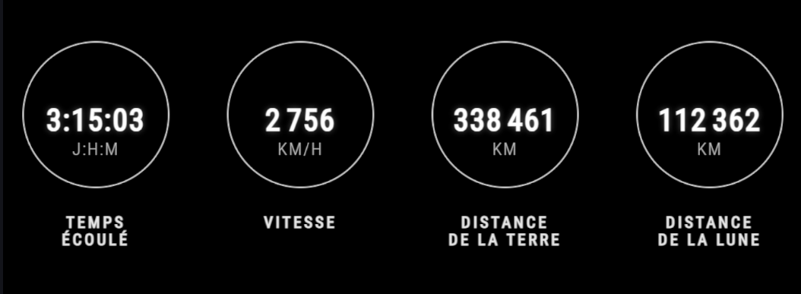
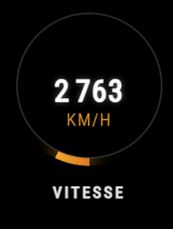
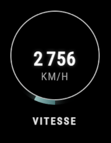
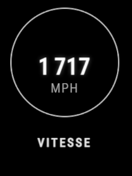

# ORION Metrics 

[English](README.md) | [Français](README.fr.md)

> [!NOTE]
> Ce projet est archivé et ne sera plus jamais mis à jour. L'équipage d'Artemis II est revenu sur Terre le 10 Avril 2026 à 2h07 (Heure de Paris) après 9 jours et 17 heures dans l'espace.<br>Made with ❤ by TGA25dev 11/04/26

**ORION Metrics** est un overlay open source pour la mission Artemis II de la NASA. Le projet récupère le flux de données officiel du site [ARROW](https://www.nasa.gov/missions/artemis-ii/arow/) et convertit ces données en unités métriques en temps réel. Il permet également d'utiliser ces données dans les logiciels de diffusions tels que OBS Studio par exemple.



# Quickstart
Vous pouvez ajouter l'overlay directement dans **OBS Studio**, **Streamlabs** ou tout autre logiciel de diffusion en tant que **source navigateur**

1. Créez une nouvelle **source navigateur**
2. Parametrez l'URL :

``` plaintext
https://orionmetrics.pronotif.tech/
```
3. Réglez la largeur et la hauteur (recommandé : 1200x400 pour l'affichage horizontal ou 400x1500 pour l'affichage vertical).<br>

<small>NOTE : l'arrière-plan est transparent par défaut, mais il peut être personnalisé (voir ci-dessous).</small>

## Paramètres personnalisés
Vous pouvez personnaliser l'overlay en ajoutant des **paramètres d'URL** à la fin du lien :

### Unités
Bascule entre le système métrique et le système impérial
- **Métrique** : `?unit=metric` *(par défaut)* affiche les valeurs en km et km/h
- **Impérial** : `?unit=imperial` affiche les valeurs en miles et mph

### Thèmes de couleur
Modifiez le thème de couleur de l'overlay



- **Par défaut** : *(par défaut)* `?style=default`
- **Orange** : `?style=orange`

### Barre de progression
Active ou désactive la barre de progression autour des cercles


- **Activer** : *(par défaut)* `?progress=true`
- **Désactiver** : `?progress=false`

### Animations
Active ou désactive les transitions animées des nombres [(NumberFlow)](https://number-flow.barvian.me/vanilla)
- **Activer** : *(par défaut)* `?animations=true`
- **Désactiver** : `?animations=false`

Si le paramètre `animations` n'est pas présent dans l'URL, il est automatiquement activé avec `animations=true`.

### Langue
Change la langue de l'overlay
- **Français** : *(par défaut)* `?lang=fr`
- **Anglais** : `?lang=en`

### Arrière plan
Permet d'améliorer la lisibilité sur différents flux vidéo en ajoutant un arrière-plan derrière les HUD
- **Transparent** : *(par défaut)* aucun arrière-plan
- **Nuit givrée** : `?bg=darker` ajoute une teinte sombre floutée semi transparente
- **Noir uni** : `?bg=solid-black` ajoute un fond noir opaque pour plus de lisibilité

#### Exemple d'URL : `https://orionmetrics.pronotif.tech/?unit=metric&style=default&progress=false&bg=darker&animations=true`

## Note
**Précision des données :** Cet outil utilise les vecteurs bruts de l'API NASA AROW. Comme ils sont convertis du système impérial vers le système métrique, les calculs peuvent légèrement s'écarter de la réalité en raison des arrondis et de la projection vectorielle. Désolé...

## Licence
Distribué sous la licence MIT (voir le fichier [LICENSE](LICENSE) pour plus d'informations)
Built with ❤ for the space community